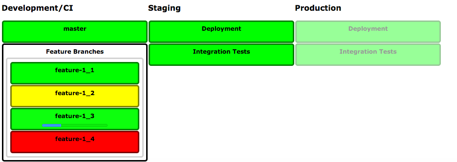

# Quality Status Page

Library for building pages that render status information., e.g. from Jenkins jobs. Simply load it into your HTML page and add a custom element for each job.

## Example

HTML for setting up a status page looks like

    <!doctype html>
    <html>
    
    <head>
        <title>Quality Status: Example Page</title>
        <link rel="stylesheet" href="https://pkaul.github.io/projects/quality-status-page/releases/0.4.0/quality-status.css"/>
        
    </head>
    
    <body>
    
        <h3>Development/CI</h3>
        <jenkins-job url="http://jenkins1/jobs/myservice-master-ci" name="master"></jenkins-job>
        <jenkins-job url="http://jenkins1/jobs/myservice-branches-ci" name="Feature Branches"></jenkins-job>
        
        ...
        
        <auth-config base-url="http://jenkins1" cors="true"/>
               
    </body>
    </html>

## Tag Reference

### &lt;jenkins-job&gt;
Renders a Jenkins job status or (depending on configuration) a set of jobs.

|Attribute|Required|Description|
|---------|--------|-----------|
|url|yes|Jenkins job's URL, e.g. `http://jenkinshost/job/jobname`. Single- as well as multi branch pipeline jobs are supported here|
|name|no|A name to be used when rendering this status. If omitted, the job's name will be fetched from provider|

### &lt;auth-config&gt;
Authentication and security configuration for status provider (e.g. Jenkins). 

|Attribute|Required|Description|
|---------|--------|-----------|
|base-url|yes|Provider's base url, e.g. `http://jenkinshost`|
|username|no|Basic authentication username. Will be sent with every request if available. Can be omitted if a session cookie is available, e.g. by having logged in to this server manually (recommended)|
|password|no|Basic authentication password|
|cors|no|Whether to enable Cross-Origin-Resource-Sharing (CORS). Typically needs to enabled when using existing session cookie for authentication. Requires server as well to support CORS (see below)|

#### Jenkins Security/CORS configuration
For security reasons, modern web browsers prevent fetching data via AJAX as a default. In order to enable data to be fetched, servers (here: Jenkins) need to
support [CORS](https://en.wikipedia.org/wiki/Cross-origin_resource_sharing) protocol. These steps need to be executed to make Jenkins aware or CORS

* Install [Cors Filter Plugin](https://wiki.jenkins-ci.org/display/JENKINS/Cors+Filter+Plugin) 
* Configure `"Manage Jenkins" -> "Configure System" -> "CORS Filter"` like

        Is Enabled:                     true
        Access-Control-Allow-Origins:   * (or a list of "host:port")

## Build this project
* Precondition: node.js is installed
* `npm install`
* `grunt`

